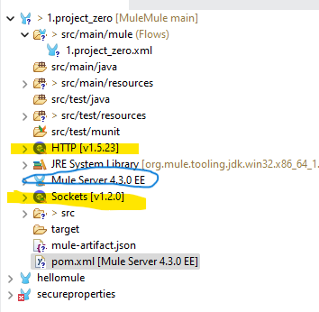

# MuleMule
MuleSoft project
API-led connectivity approach

A framework that combines microservices architecture with a holistic API strategy to connect through well-defined layers, 
different types of pupose-built, resuable APIs designed with the consumption of data top of mind.

3 types of APIs
1. system APIs - provide us an access to the underlying core systems of record and expose data. (exposes backend database without business logic)
2. Process APIs - Typically, allow us to compose, transform, enrich, aggregate and orchestrate data as needed.
3. Experience APIs - Allow us to ease reconfigure data according to specific needs of the end user

What are the benefits of API-led aonnectivity?
01 Assests as APIs - use of APis to provide both a consumable and controlled means of accessing systems or applications
02 APIs are resuable and designed to be easily changes abd consumed across multiple applications
03 Faster development -APIs are resusable and designed to be easily changed and consumed across multiple applications
04 Improve governance - with APIS we can provide access to data and business logic in a governed and secured form
05 Transition to cloud- Speed up the transition of legacy systems to a cloud infrastructure easily and helps to innovate faster

Why should I invest time in learning Mulesoft
1. API growth rate https://techbeacon.com/app-dev-testing/3-ways-apis-help-developers-deliver-software-faster
2. MuleSoft is a market leader - for enterprise integration, for full  Lifecycle API Management
3. return on investment

Learning map
install development tools -> create the project zero -> HTTP connectors->DataWeave Language, Variable properties Files ->VM connectors
->Database Connectors ->File connectors ->Error Handling ->Anypoint platform designer (Design Center), Deploy API -> Test using Postman

How to get most out of the courses
1. watch or read over and over again until you understand it!
2. Hands on approach, do excercises
3. Ask questions
4. use MuleSoft documentation
5. Use Google

Installation 
1. install java 8
 create %JAVA_HOME%\bin to point the jdk, echo %JAVA_HOME%, echo %PATH%
  
 >java -version
        java version "11.0.9" 2020-10-20 LTS
        Java(TM) SE Runtime Environment 18.9 (build 11.0.9+7-LTS)
        Java HotSpot(TM) 64-Bit Server VM 18.9 (build 11.0.9+7-LTS, mixed 

2. Install Maven
    %MAVEN_HOME%\bin %M2_HOME%\bin
    echo %MAVEN_HOME
    echo %M2_HOME%

    >mvn -v
        Apache Maven 3.6.3 (cecedd343002696d0abb50b32b541b8a6ba2883f)
        Maven home: C:\ProgramData\chocolatey\lib\maven\apache-maven-3.6.3\bin\..
        Java version: 1.8.0_192, vendor: Oracle Corporation, runtime: C:\Program Files\AdoptOpenJDK\jdk8u192-b12\jre
        Default locale: en_NZ, platform encoding: Cp1252
        OS name: "windows 10", version: "10.0", arch: "amd64", family: "windows"

3. install Git choco install git -y
   >git --version
        git version 2.35.1.windows.2

4. install postman choco install postman -y
5. Install MariaDB (free opensource db) - for testing puposes
   https://www.mariadbtutorial.com/getting-started/install-mariadb/
   msi is downloaded.
   set root password
   TCP port 3306
   Find the MariaDB tools in the startup Menu
 
   

    Also can be accessed by GUI HeidiSQL
    
    

6. find the .exe in D:\Devtools\AnypointStudio\AnypointStudio.exe
   workspace: D:\Projects_Mule\MuleMule\AnypointStudio\studio-workspace
   
   mac versions

7. Create the first Mulesoft project

1. File>new>Mule Project > (create project name 1.Project_zero)
</br>two dependencies and Mule runtime engine </br>


"1.Project_zero.xml" </br>
Editor is devided into 3 different sections: Message flow (visual representions), Global elements (connections), configuration xml (xml represnetion)
Mule palette - connectors and processors
Mule properties view changes according to the connectors dragged into the editor. </br>window>show view>console </br>
2. Add HTTP - Listner </br> 
  General -Configure Litsner (all defaults) - Test the connection path /mulesoft
  configure global element for the connector. add a connector configuration and test connection 
  Reponses - Set Payload (set value to "Hello Mule") </br>
  Advanced - set allowed methods - GET </br>
  Save. Right click on the project -> run ( deployement fails!!) </br>
  Reason- flow must contain two parts. source and process.here process is empty.
3. Add a logger to the message flow </br> General- Message "Start log" </br>
   DEPLOYED
   curl -v GET http://localhost:8081/project-zero </br>
   Hello world!* Connection #1 to host localhost left intact
   
4. set payload (by adding set payload component) to "Hello from set payload" instead of hard-cording and update listner reponse to use the payload. save. application will recompile. </br>
test - "Hello from set payload" is received.

| Question     | Answer |
| ----------- | ----------- |
| What are the pre-requisites to install Mulesoft?      | Java     |
| What is the minimum required configuration in a flow for a Mule application to compile?  | An event processor        |
|Is it possible to install different runtime versions in Anypoint Studio?|yes|
|In Anypoint Studio, how many tabs are part of the Mule Configuration file?|3|

    
### Http connector
Explore the potential of http connector
1. create a new Mule project 2.http_connector
2. It is a good practice to create all global elements in an independent Mule config file - (call it global)
#### globally config http listner
3. Global elements -> http Listener config 
4. drag a listner and choose the conector configuration to use http listener config
5. path /basic/*
6. rename the cflow to the "basics"
7. rename the name of the log to "log START". Set up a message "log START -" + name of the flow (++ flow.name)
Note: this flow.name works only inside the log
8. test http://localhost:8080/basic
9. add breakpoint at logger and use debug mode to observe
#### using URI parameters
10. create a new flow "uriParams" , path "/uriParams/[ID]"
11. Change the XML to include a message message='#["log START - " ++ flow.name]12. Set the payload to attributes.uriParams."ID"
13. Run the application in debug mode with break point in log START to get the uri parameters
14. test http://localhost:8080/uriParams/10
#### using Query Parameters
15. create a new flow "queryParams", path "/queryParams
16. add a log message
17. set the payload 
   ```
      %dw 2.0
      output application/json
      ---

      attributes.queryParams
   ```
18. Test http://localhost:8080/queryParams?ID=3
    http://localhost:8080/queryParams?ID=3&msgtype=greetings&message=helloworld
19. modify the payload to - attributes.queryParams.msgtype to get a particular parameter 

### Send HTTP request within a Mule flow
1. Configure HTTP request configuration 
2. Drag Request configuration to "basic" flow
#### Request
3. change Request to use HTTP_Request_configuration
4. Request GET path /queryParams
5. define the static Query Parameters (K1,V1)(K2,V2)(K3,V3)
6. advanced tab - define an output target variable -requestResponse
7. change the HTTP GET basics listener to extract response body from 
   vars.requestResponse
8. test  http://localhost:8080/basic
9. introduce dynamic query parameters - use se variable component to set variables before request component is called.
rename the component to Set query params -> settings -> value
```
{  
    'param1':'value1',
	'param2':'value2',
	'param3':'value3'
}
```
10. then change the request to use the set variable -> query Parameters 
   vars.customMap
11. test  http://localhost:8080/basic
12. dealing with the empty parameters - logic required
 change reuest 
 ```
 output application/java
---
{
	('k1': vars.customMap.param1) if (vars.customMap.param1 != null and vars.customMap.param1 != ''),
	('k2': vars.customMap.param2) if (vars.customMap.param2 != null and vars.customMap.param2 != ''),
	('k3': vars.customMap.param3) if (vars.customMap.param3 != null and vars.customMap.param3 != '')
}
 ```