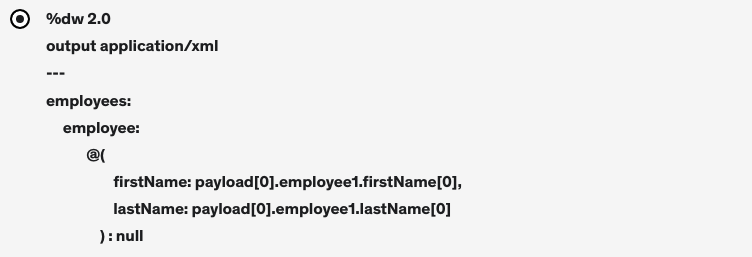

# MuleMule
MuleSoft project
API-led connectivity approach

A framework that combines microservices architecture with a holistic API strategy to connect through well-defined layers, 
different types of pupose-built, resuable APIs designed with the consumption of data top of mind.

3 types of APIs
1. system APIs - provide us an access to the underlying core systems of record and expose data. (exposes backend database without business logic)
2. Process APIs - Typically, allow us to compose, transform, enrich, aggregate and orchestrate data as needed.
3. Experience APIs - Allow us to ease reconfigure data according to specific needs of the end user

What are the benefits of API-led aonnectivity?
01 Assests as APIs - use of APis to provide both a consumable and controlled means of accessing systems or applications
02 APIs are resuable and designed to be easily changes abd consumed across multiple applications
03 Faster development -APIs are resusable and designed to be easily changed and consumed across multiple applications
04 Improve governance - with APIS we can provide access to data and business logic in a governed and secured form
05 Transition to cloud- Speed up the transition of legacy systems to a cloud infrastructure easily and helps to innovate faster

Why should I invest time in learning Mulesoft
1. API growth rate https://techbeacon.com/app-dev-testing/3-ways-apis-help-developers-deliver-software-faster
2. MuleSoft is a market leader - for enterprise integration, for full  Lifecycle API Management
3. return on investment

Learning map
install development tools -> create the project zero -> HTTP connectors->DataWeave Language, Variable properties Files ->VM connectors
->Database Connectors ->File connectors ->Error Handling ->Anypoint platform designer (Design Center), Deploy API -> Test using Postman

How to get most out of the courses
1. watch or read over and over again until you understand it!
2. Hands on approach, do excercises
3. Ask questions
4. use MuleSoft documentation
5. Use Google

Installation 
1. install java 8
 create %JAVA_HOME%\bin to point the jdk, echo %JAVA_HOME%, echo %PATH%
  
 >java -version
        java version "11.0.9" 2020-10-20 LTS
        Java(TM) SE Runtime Environment 18.9 (build 11.0.9+7-LTS)
        Java HotSpot(TM) 64-Bit Server VM 18.9 (build 11.0.9+7-LTS, mixed 

2. Install Maven
    %MAVEN_HOME%\bin %M2_HOME%\bin
    echo %MAVEN_HOME
    echo %M2_HOME%

    >mvn -v
        Apache Maven 3.6.3 (cecedd343002696d0abb50b32b541b8a6ba2883f)
        Maven home: C:\ProgramData\chocolatey\lib\maven\apache-maven-3.6.3\bin\..
        Java version: 1.8.0_192, vendor: Oracle Corporation, runtime: C:\Program Files\AdoptOpenJDK\jdk8u192-b12\jre
        Default locale: en_NZ, platform encoding: Cp1252
        OS name: "windows 10", version: "10.0", arch: "amd64", family: "windows"

3. install Git choco install git -y
   >git --version
        git version 2.35.1.windows.2

4. install postman choco install postman -y
5. Install MariaDB (free opensource db) - for testing puposes
   https://www.mariadbtutorial.com/getting-started/install-mariadb/
   msi is downloaded.
   set root password
   TCP port 3306
   Find the MariaDB tools in the startup Menu
 
   

    Also can be accessed by GUI HeidiSQL
    
    

6. find the .exe in D:\Devtools\AnypointStudio\AnypointStudio.exe
   workspace: D:\Projects_Mule\MuleMule\AnypointStudio\studio-workspace
   
   mac versions

7. Create the first Mulesoft project

1. File>new>Mule Project > (create project name 1.Project_zero)
</br>two dependencies and Mule runtime engine </br>


"1.Project_zero.xml" </br>
Editor is devided into 3 different sections: Message flow (visual representions), Global elements (connections), configuration xml (xml represnetion)
Mule palette - connectors and processors
Mule properties view changes according to the connectors dragged into the editor. </br>window>show view>console </br>
2. Add HTTP - Listner </br> 
  General -Configure Litsner (all defaults) - Test the connection path /mulesoft
  configure global element for the connector. add a connector configuration and test connection 
  Reponses - Set Payload (set value to "Hello Mule") </br>
  Advanced - set allowed methods - GET </br>
  Save. Right click on the project -> run ( deployement fails!!) </br>
  Reason- flow must contain two parts. source and process.here process is empty.
3. Add a logger to the message flow </br> General- Message "Start log" </br>
   DEPLOYED
   curl -v GET http://localhost:8081/project-zero </br>
   Hello world!* Connection #1 to host localhost left intact
   
4. set payload (by adding set payload component) to "Hello from set payload" instead of hard-cording and update listner reponse to use the payload. save. application will recompile. </br>
test - "Hello from set payload" is received.

| Question     | Answer |
| ----------- | ----------- |
| What are the pre-requisites to install Mulesoft?      | Java     |
| What is the minimum required configuration in a flow for a Mule application to compile?  | An event processor        |
|Is it possible to install different runtime versions in Anypoint Studio?|yes|
|In Anypoint Studio, how many tabs are part of the Mule Configuration file?|3|

    
### Http connector
Explore the potential of http connector
1. create a new Mule project 2.http_connector
2. It is a good practice to create all global elements in an independent Mule config file - New -> Mule configuration file (call it global)
#### globally config http listner
3. Global elements -> http Listener config 
4. drag a listner and choose the conector configuration to use http listener config
5. path /basic/*
6. rename the cflow to the "basics"
7. rename the name of the log to "log START". Set up a message "log START -" + name of the flow (++ flow.name)
Note: this flow.name works only inside the log
8. test http://localhost:8080/basic
9. add breakpoint at logger and use debug mode to observe
#### using URI parameters
10. create a new flow "uriParams" , path "/uriParams/[ID]"
11. Change the XML to include a message message='#["log START - " ++ flow.name]12. Set the payload to attributes.uriParams."ID"
13. Run the application in debug mode with break point in log START to get the uri parameters
14. test http://localhost:8080/uriParams/10
#### using Query Parameters
15. create a new flow "queryParams", path "/queryParams
16. add a log message
17. set the payload 
   ```
      %dw 2.0
      output application/json
      ---

      attributes.queryParams
   ```
18. Test http://localhost:8080/queryParams?ID=3
    http://localhost:8080/queryParams?ID=3&msgtype=greetings&message=helloworld
19. modify the payload to - attributes.queryParams.msgtype to get a particular parameter 

### Send HTTP request within a Mule flow
1. Configure HTTP request configuration 
2. Drag Request configuration to "basic" flow
#### Request
3. change Request to use HTTP_Request_configuration
4. Request GET path /queryParams
5. define the static Query Parameters (K1,V1)(K2,V2)(K3,V3)
6. advanced tab - define an output target variable -requestResponse
7. change the HTTP GET basics listener to extract response body from 
   vars.requestResponse
8. test  http://localhost:8080/basic
9. introduce dynamic query parameters - use se variable component to set variables before request component is called.
rename the component to Set query params -> settings -> value
```
{  
    'param1':'value1',
	'param2':'value2',
	'param3':'value3'
}
```
10. then change the request to use the set variable -> query Parameters 
   vars.customMap
11. test  http://localhost:8080/basic
12. dealing with the empty parameters - logic required
 change reuest 
 ```
 output application/java
---
{
	('k1': vars.customMap.param1) if (vars.customMap.param1 != null and vars.customMap.param1 != ''),
	('k2': vars.customMap.param2) if (vars.customMap.param2 != null and vars.customMap.param2 != ''),
	('k3': vars.customMap.param3) if (vars.customMap.param3 != null and vars.customMap.param3 != '')
}
 ```
| Question     | Answer |
| ----------- | ----------- |
| A web client send a request to a Mule application to the endpoint /order?id=13579. Where is the id stored in the Mule event by the HTTP Listener?| Attributes |
|In the HTTP Listener, what is the purpose of using the wildcard "/*" in the value for Path?|To listen for all incomming requests to any pth within the specified base path|
|A web service implements an API to handle requests to https://www.polarising.com/employee/{id}. A web client makes a request to this API implementation at https://www.polarising.com/employee/4. What is the correct DataWeave expression to retrieve the value id?|#[attributes.uriParams.id]|

#### EXCERCISE

1.  create a mule config file exercise.xml
2. Listener path /excercise/{ID}
3. setpayload
```
output application/json
---
{
	"uriParams": attributes.uriParams,
	"queryParams": attributes.queryParams
}
```
## DataWeave
DataWeave is a functional programming language designed for transforming data. It is MuleSoft's primary language for data transformation, as well as the expression language used to configure components and connectors. However, DataWeave is also available in other contexts, like as a command-line tool.

DataWeave is basically a MuleSoft expression language. It is mainly used for accessing and transforming the data received through a Mule application. Mule runtime is responsible for running the script and expressions in our Mule application, DataWeave is strongly integrated with Mule runtime.

DataWeave scripts are divided into two main sections, the header, and the body. The header defines directives that apply to the body, and the body contains an expression that returns an output. The header is located above the body delimiter which consists of three dashes --- anything above the three dashes is the header, and anything below the three dashes is the body.
https://docs.mulesoft.com/mule-runtime/3.9/mel-cheat-sheet

"Transform Message (Core) component </br>
1. concaternate two strings into a single string 
```
%dw 2.0


output application/json
---
{
	"test":("hello "++"world")
}
```
2. Transform json to xml
```
output application/xml
---
{
	"test":("hello "++"world")
}
```
3. create a variable in dataweave
```
%dw 2.0

var myVar = {
	"test":("hello "++"world")
}

output application/json
---
myVar
```
4. use dataweave native functions
```
%dw 2.0

var myVar = {
"sum": sum([3,4,5,3,5]),
"avg": avg([100,100,100]),
"even":isEven(5),
"uppercase":upper("deepa"),
"leap_year":isLeapYear(2022),
"timestamp": now()
}

output application/json
---
myVar
```
read file content
```
%dw 2.0
output application/json
---
readUrl("classpath://peopleName.json")
```

define metadata
upload the file as the example
```
%dw 2.0
output application/json
---
payload
```
Dataweave: How to access and transform objects and arrays

### Arrays

https://docs.mulesoft.com/dataweave/2.4/dw-core-functions-map
```
%dw 2.0
output application/java
---
["jose", "pedro", "mateo"] map (value, index) -> { (index) : value}

%dw 2.0
output application/json
---
['a', 'b', 'c'] map ((value, index) -> (index + 1) ++ '_' ++ value)

%dw 2.0
output application/json
---
['joe', 'pete', 'matt'] map ( "$$" : $)
%dw 2.0
output application/csv
---
[{
 "age": 14 ,
 "name": "Claire"
}, {
 "age": 56,
 "name": "Max"
}, {
 "age": 89,
 "name": "John"
}] map {
   age: $.age,
   name: $.name
}
```
map elements from array to an object
```
var customArray = [
	"MuleSoft",
	"fundamentals",
	"course"
]

output application/json
---
customArray map ((value, index) -> index :(index + 1) ++ '_' ++ value)
```
pluck object into an array
```
%dw 2.0

var customObj = { 
	"0": "Mulesoft",
	"1": "fundamentals",
	"2": "course"
}
output application/json
---
customObj pluck((value) -> value)
```
filter
```
%dw 2.0

var  customArray = [1,2,3,4,5,6,7,8,9,10]
output application/json
---
{
	"collection" : customArray filter ((value,index) -> value > 5)
}
```
filter an object
```
%dw 2.0

var customObj = { 
	"0": "Mulesoft",
	"1": "fundamentals",
	"2": "course",
	"3": "easy",
	"4": "way"
}

output application/json
---
{
	"collection":customObj filterObject ((value , key) ->
		sizeOf(value) < 7 and (key contains 3)  
	)
}
```
### DataWeave Selectors
https://docs.mulesoft.com/dataweave/2.4/dataweave-selectors

```
%dw 2.0

var customObj = { 
	"people":{
		"person": {
			"name": "John"
		},
		"person": {
			"name": "Jane"
		}
	}
}
output application/json
---
/**
 * selectors only return the value of the first matching key, 
 * even if the object contains multiple matching keys.
 */
customObj.people.person.name

%dw 2.0

var customObj = { 
	"people":{
		"person": {
			"name": "John"
		},
		"person": {
			"name": "Jane"
		}
	}
}
output application/json
---
/**
 * selectors only return the value of the first matching key, 
 * even if the object contains multiple matching keys.
 * add a * to return multiple
 */
customObj.people.*person

%dw 2.0
var customString = "MuleSoft"

output application/json
---

/**
 * the string is broken into an array where
 * each character is an index
 */
 
customString[0]

%dw 2.0
var customString = "MuleSoft"

output application/json
---

/**
 * limits the output to only the elements specified
 * by the range on that special
 */
 
customString[2 to 6]

decalre and invoke a function in a Mule flow

```
 %dw 2.0

  fun createString(obj)={
	 description: obj
 }

 output application/json
---
{
	"root" : createString(payload)
}
```
test http://localhost:8080/lambdas
payload
```
{
"field1":"MuleSoft",
"field2":"fundamentals",
"field3":"course"
}
```   
response
```
{
    "root": {
        "description": {
            "field1": "MuleSoft",
            "field2": "fundamentals",
            "field3": "course"
        }
    }
}
```   
define metadata  > add json as example
Change  output
```
   %dw 2.0

   fun createString(obj)={
	description: obj.field1 ++ " " ++ obj.field2++ " " ++ obj.field3
    }

    output application/json
   ---
  {
	  "root" : createString(payload)
  }
```
test http://localhost:8080/lambdas
payload
```
{
    "root": {
        "description": "MuleSoft fundamentals course"
    }
}
```

maps and merges fields from items in seperate arrays


   %dw 2.0

   var books =[
	   {
		bookid: 100,
		title : "Mule Mule",
		price : "20.00"
	},
	{
		bookid: 101,
		title : "Mule fundamentals",
		price : "28.00"
	},
	{
		bookid: 102,
		title : "Mule 101",
		price : "36.00"
	}
	
]
var authors =[
	{
		bookid: 100,
		author:"know itall"
	},
	{
		bookid: 101,
		author:"la la land"
	},
	{
		bookid: 102,
		author:"Mule nutter"
	}
]
output application/json
---
{
	"booksResult": books map ((item, index) -> 
		//create a dynamic variable at the map level
		do {
  var id = item.bookid
  ---
  {
    "id": id,
    "topic": item.title,
    "cost": item.price,
    // lets attach the author to the book object
    (authors filter ($.*bookid contains id) map (item) -> {
      // $.*bookid refers to author array
      "author": item.author
    })
  }
}
	)
	}


returns only the values of matching keys within an object

   %dw 2.0

var booksList = [
	book: {
		bookId : 101,
		title: "mulesoft course",
		"price": "20.00"
	},
	book: {
		bookId : 202,
		title: "mulesoft fundamentals",
		"price": "10.00"
	},
	book: {
		bookId : 303,
		title: "mulesoft essentials",
		"price": "15.00"
	}
]
output application/json
---

//lets get all the prices > 15.00
"prices":booksList.book.price[?($ >15)]

//? -> validates if the key "price" exists
// and if exists, check if value > 15]
```
| Question     | Answer |
| ----------- | ----------- |
|A flow contains an HTTP Listener as the event source. What is the DataWeave expression to log the Content-Type header using a Logger component?|#['Content-Type:'++attributes.headers.'content-type'|
|Refer to the exhibit. What is the correct DataWeave expression for accessing the city Cleveland from the JSON payload? </br> [](exhibit01.png) | #[payload[1].city]|
|Refer to the exhibit. An event payload contains an unordered array of flight objects, where every object has a price key and a toAirport key. What is valid DataWeave code to return flights with price under 500, grouped by toAirport in ascending order, with the lowest price first? </br> [](exhibit02.jpeg)|Payload filter $.price<500 orderBy $.price groupBy $.toAirport|
|Refer to the exhibit. What is the valid DataWeave code to transform the input JSON payload to the output XML payload? </br> [](exhibit03.jpeg)|[](exhibit04.png)|
|Refer to the exhibit. What is the valid DataWeave code to get the output JSON payload? </br> [](exhibit05.jpeg) | customObj.people.&person[0]|customObj.people.&person[0]|

#### EXCERCISE
Use a scope variable called "sum_prices_cost" to store the sum of all the prices defined in an array of integers. This array will contain 5 different amounts: [17, 10, 20, 5, 10]. Then, output an JSON object with a list of product descriptions whose result of the calculation "quantity*unit_price" is higher than "sum_prices_cost".

```
%dw 2.0

var itemsList = {
	"items":[
		"item":{
			"description": "Product1",
			"quantity": 1,
			"unit_price": 20,
			"toDiscount": "No"
		},
		"item":{
			"description": "Product2",
			"quantity": 2,
			"unit_price": 30,
			"toDiscount": "Yes"
		},
		"item":{
			"description": "Product3",
			"quantity": 3,
			"unit_price": 40,
			"toDiscount": "Yes"
		}
	]
}

output application/json
---
using (sum_prices_cost = [17, 10, 20, 5, 10] reduce ((element, accumulated) -> accumulated + element))
{
	"products": itemsList.items.*item default [] map ((currItem) -> 
		using (item_total_price = currItem.quantity * currItem.unit_price)
		if (item_total_price < sum_prices_cost) (currItem.description) else ""
	)}
```
Scoped Variables:

To declare a variable in the DataWeave body, the following syntax is supported: using (<variable-name> = <expression>) and it must be written before defining the contents of the literal that it exists in. To reference an already initialized variable, you can just call it by the name you defined for it as with any other variable, or you can also write it in the form $<variable-name>.

https://docs.mulesoft.com/mule-runtime/3.9/dataweave-language-introduction#variables

If else conditional expression:

An if statement evaluates a conditional expression and returns the value under the if only if the conditional expression is true. Otherwise, it will return the expression under else.

https://docs.mulesoft.com/mule-runtime/4.3/dataweave-flow-control#control_flow_if_else

```
%dw 2.0

var tax = 0.23
var discount = 0.10

var itemsList = {
	"items":[
		"item":{
			"description": "Product1",
			"quantity": 1,
			"unit_price": 20,
			"toDiscount": "No"
		},
		"item":{
			"description": "Product2",
			"quantity": 2,
			"unit_price": 30,
			"toDiscount": "Yes"
		},
		"item":{
			"description": "Product3",
			"quantity": 3,
			"unit_price": 40,
			"toDiscount": "Yes"
		}
	]
}


output application/json
---
"invoice": {
	"items": 
		itemsList.items.*item map ((item) -> 
		using( item_final_price = item.unit_price * item.quantity)
		{
			"item": item.description,
			"quantity": item.quantity,
			"unit_price": item.unit_price,
			"discount": if (item.toDiscount contains "Yes") (discount) else (0.00),
			("cost": if (item.toDiscount contains "Yes") 
				(item_final_price * (1- discount))
			else item_final_price)
		}
				
	),
	"total": 
		using (sum_items_cost = itemsList.items.item.*unit_price default [] reduce ( (element, accumulated = 0) -> accumulated + element) )
		{
			"total_cost_before_taxation": sum_items_cost,
			"taxation": tax*100 ++ "%",
			"total_cost_after_taxation": sum_items_cost * (1 + tax) as Number
		}
}
```
## Property Files

1. /src/main/resources/conf1.yaml
```
http:
  host: "localhost"
  port: "8080"
  path: "/test1"
  
message: " yaml file used"
```
2. src/main/resources/conf2.properties
```
http.host=localhost
http.port=8081
http.path=/test2

message=properties file 
```
3. add 2 global configuration elements </br> [](GlobalConfigElements.png)

4. Http Listener config (Configuration) 
```
   Host:${http.host}
   Port:${http.port}
```

5. Configuration properties (Configuration)
 ```
      File:conf1.yaml
 ```
6. Create a Mule flow. </br>

[](4.HttpGet.png) </br>
[](4.Logger.png) </br>
[](4.setpayload.png)
 
 
 6. run as Mule application and test
 ```
 http://localhost:8080/test1

 payload : yaml file used                                  
 ```
